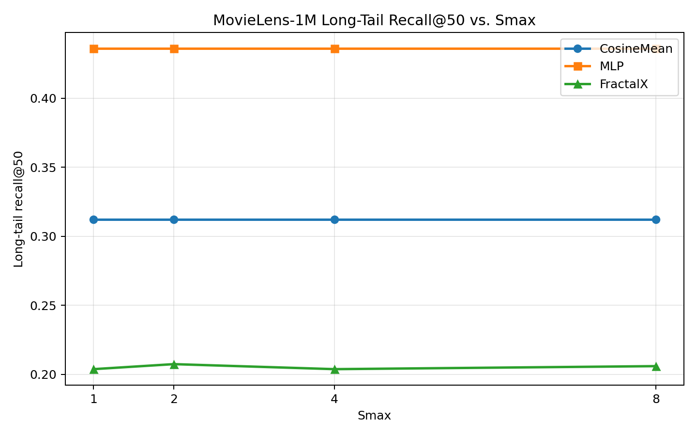

# Fractal Interference Framework for Hierarchical User Interest Modeling in Recommendation Systems

**A proposal for improving personalization in social media feeds, including X/Twitter's For You algorithm**

**Author:** Rick Glenn / @exocognosis  
**Date:** April 2026  
**Status:** Open for discussion and implementation  
**License:** CC BY 4.0

## Abstract

Modern recommendation algorithms can suffer from shallow interest modeling: embeddings often compress user preferences into flat vectors, leading to over-generalization and irrelevant "garbage" content flooding feeds. Real human interests are **hierarchical and self-similar**. They can exhibit fractal-like structure across scales: broad topic, niche sub-topic, and hyper-specific details.

This framework models a user's engagement history as a **point cloud** in embedding space and represents it as a **complex-valued interference field**. New posts are scored by how constructively or destructively they interfere with this field at multiple resolutions. The prototype uses an intrinsic-dimension estimate as a user-specific regularizer rather than leaving "fractal dimension" as decorative math.

The current empirical status is mixed. A toy two-interest experiment shows the intended failure mode for mean-vector cosine similarity, but a sampled MovieLens-1M evaluation does **not** beat cosine or an MLP baseline on long-tail recall. Treat this as a working research prototype, not as a validated ranking improvement.

## 1. Problem and Rationale

- Current systems rely on vector similarity or transformer-predicted engagement. One tangential interaction can flood the feed with loosely related drama.
- Interests are **fractal**: "Technology" contains "AI", which contains "neural scaling laws", which contains specific papers or Grok training details. This self-similarity repeats at every zoom level.
- Wave interference naturally captures reinforcement, or constructive interference, versus noise, or destructive interference, providing a multi-scale filter that linear embeddings miss.
- By integrating intrinsic-dimension analysis and interference scoring, a platform might suppress irrelevant content more aggressively while surfacing deep sub-interests. The current MovieLens-1M experiment does not prove this yet.

This is grounded in established techniques:

- Intrinsic-dimension estimation, using TwoNN in the prototype because naive box-counting is sample-hungry in high-dimensional embedding spaces.
- Complex wave superposition, including Fourier and wavelet methods in ML.
- Multi-resolution analysis, common in computer vision and time-series.

## 2. Mathematical Framework

### 2.1 User Interest Fractal: Point Cloud

Let $\mathcal{E} \subset \mathbb{R}^d$ be the post embedding space.

A user's weighted engagement history forms the point cloud:

$$
P = \{ (\mathbf{p}_i, A_i) \}_{i=1}^n, \quad \mathbf{p}_i \in \mathcal{E}, \ A_i \geq 0
$$

where $A_i$ is the engagement strength, such as likes, replies, dwell time, or other weighted interaction signals.

### 2.2 Intrinsic Dimension: User-Specific Regularization

The original draft used box-counting dimension:

$$
D = \lim_{\epsilon \to 0} \frac{\log N(\epsilon)}{\log (1/\epsilon)}
$$

where $N(\epsilon)$ is the number of $\epsilon$-boxes needed to cover $P$. In high-dimensional recommender embeddings, this is often too sample-hungry for per-user histories.

The prototype therefore uses **TwoNN** as the default intrinsic-dimension estimator. For each history point, let $r_{1,i}$ and $r_{2,i}$ be the distances to its first and second nearest neighbors, and let:

$$
\mu_i = \frac{r_{2,i}}{r_{1,i}}
$$

TwoNN estimates $\hat{D}$ from the slope of:

$$
-\log(1 - F(\mu)) \approx \hat{D} \log \mu
$$

The implementation caps this with a PCA participation-ratio estimate to avoid overestimating exact grids or tied-neighbor trajectories.

This $\hat{D}$ is used directly in scoring. Define:

$$
\rho = \min\left(\frac{\hat{D}}{d}, 1\right)
$$

where $d$ is the embedding dimension. $\rho$ controls how much fine-scale structure and destructive suppression the scorer trusts for a given user.

### 2.3 Multi-Scale Interest Field: Wave Representation

Represent $P$ as a smoothed complex-valued field:

$$
\psi_{P,s}(\mathbf{x}) =
\sum_{i=1}^n A_i
\exp\left(-\frac{\|\mathbf{x} - \mathbf{p}_i\|^2}{2\lambda_s^2}\right)
\exp\bigl(i \, \phi_{i,s}(\mathbf{x})\bigr) \in \mathbb{C}
$$

Phase function, multi-scale:

$$
\phi_{i,s}(\mathbf{x}) = 2\pi \, \frac{\mathbf{k} \cdot (\mathbf{x} - \mathbf{p}_i)}{\lambda_s}, \quad \lambda_s = \lambda_0 \cdot 2^{-(s-1)}
$$

where:

- $s \in \{1, \dots, S_{\max}\}$ is the resolution level. Small $s$ captures broad interests; large $s$ captures fine sub-interests.
- $\mathbf{k}$ is the wave vector. It can be derived from principal components of $P$ or randomized for diversity.
- The Gaussian envelope is a practical phase-smoothing term. Without it, distant points can alias constructively at fine scales.

### 2.4 Interference Score for Candidate Posts

For a new post with embedding $\mathbf{q} \in \mathcal{E}$, its wave contribution is:

$$
\psi_{\mathbf{q}}(\mathbf{q}) = B \exp(i \phi_q(\mathbf{q}))
$$

where $B$ is a small amplitude.

**Single-scale interference:**

$$
S_s(\mathbf{q}) = 2 \, \mathrm{Re} \bigl[ \psi_{P,s}^*(\mathbf{q}) \cdot \psi_{\mathbf{q}}(\mathbf{q}) \bigr]
$$

Multi-scale total score:

$$
\tilde{w}_s =
2^{-(s-1)}
\left(
1 + \beta \rho \frac{s-1}{S_{\max}-1}
\right)
$$

For $S_{\max}=1$, the fine-scale fraction is defined as zero.

$$
w_s = \frac{\tilde{w}_s}{\sum_j \tilde{w}_j}
$$

$$
S_{\text{raw}}(\mathbf{q}) = \sum_{s=1}^{S_{\max}} w_s \, S_s(\mathbf{q})
$$

Dimension-regularized destructive suppression:

$$
S_{\text{total}}(\mathbf{q}) =
\begin{cases}
S_{\text{raw}}(\mathbf{q}), & S_{\text{raw}}(\mathbf{q}) \geq 0 \\
\left(1 + \eta(1-\rho)\right)S_{\text{raw}}(\mathbf{q}), & S_{\text{raw}}(\mathbf{q}) < 0
\end{cases}
$$

Interpretation:

- $S_{\text{total}}(\mathbf{q}) \gg 0$: Strong constructive interference - boost.
- $S_{\text{total}}(\mathbf{q}) \ll 0$: Destructive interference - suppress as garbage.
- $|S_{\text{total}}(\mathbf{q})|$: Confidence of alignment.
- Higher $\rho$ gives more relative weight to fine scales.
- Lower $\rho$ makes destructive interference more aggressive because a low-dimensional, concentrated history provides a cleaner "not like this" signal.

### 2.5 Hybrid Ranking

Combine with an existing transformer scorer $R_{\text{trans}}(\mathbf{q})$:

$$
R_{\text{final}}(\mathbf{q}) = R_{\text{trans}}(\mathbf{q}) + \alpha \cdot S_{\text{total}}(\mathbf{q})
$$

where $\alpha > 0$ is learned through A/B testing or online gradient updates.

## 3. Computational Complexity and Practical Implementation

- Per-user field construction: $O(n)$ once per session, or incrementally.
- Scoring per candidate: $O(n S K)$ naive, where $S$ is the number of scales and $K$ is the number of wave vectors. This is reducible using random Fourier features, locality-sensitive hashing, or candidate prefiltering.
- Fully compatible with X's open-source Phoenix Scorer pipeline: candidate sourcing, ranking, and filtering.

The entire module can be added as a lightweight auxiliary scorer without retraining the core model.

## 4. Expected Benefits and Current Empirical Status

The benefits below are hypotheses, not proven production claims.

The included toy experiment has two symmetric user-interest clusters. In that setting, cosine similarity to the mean user vector has almost no relevant-candidate margin, while FractalX separates the relevant clusters:

| Experiment | Cosine relevant margin | FractalX relevant margin | FractalX top label |
| --- | ---: | ---: | --- |
| Two-cluster toy, seed 11 | 0.0049 | 2.0010 | relevant |

On the sampled MovieLens-1M harness, however, FractalX does **not** beat the baselines. This is the result from `python3 evaluate.py` with seed `20260430`, 350 evaluation users, 250 sampled negatives per user, ALS item embeddings, and Recall@50 restricted to items in the bottom 80% of item popularity:

| Scorer | $S_{\max}$ | NDCG@10 | NDCG@50 | MRR | Long-tail recall@50 |
| --- | ---: | ---: | ---: | ---: | ---: |
| Cosine mean | 1 | 0.1398 | 0.2648 | 0.1777 | 0.3122 |
| MLP | 1 | 0.2364 | 0.3566 | 0.3052 | 0.4360 |
| FractalX | 1 | 0.0454 | 0.1321 | 0.0746 | 0.2038 |
| FractalX | 2 | 0.0570 | 0.1464 | 0.0896 | 0.2074 |
| FractalX | 4 | 0.0568 | 0.1470 | 0.0904 | 0.2038 |
| FractalX | 8 | 0.0552 | 0.1463 | 0.0895 | 0.2060 |



Current read:

1. **The toy mechanism exists:** interference can represent multiple separated interests when the mean vector collapses them.
2. **The MovieLens result is negative:** the current FractalX scorer is worse than cosine and much worse than the MLP on long-tail recall.
3. **Multi-scale helps only weakly:** $S_{\max}=2$ improves long-tail recall from 0.2038 to 0.2074, but the effect is small and non-monotonic.
4. **The framework needs more work before public claims:** a plausible next modification is to use FractalX as an auxiliary feature inside a learned ranker, not as a standalone scorer.

## 5. Validation Plan and Open Questions

### 5.1 Offline Validation

Before any production consideration, the framework should be evaluated on public recommendation datasets where ground-truth relevance is known:

- **MovieLens-25M, Amazon Reviews, Yelp Open Dataset:** train embeddings, replay engagement histories, and measure NDCG@k, MRR, and long-tail recall against a vanilla cosine-similarity baseline and a transformer scorer baseline.
- **Ablations:** vary $S_{\max} \in \{1, 2, 4, 8\}$, $\lambda_0$, the wave-vector construction, PCA vs. random, and the weighting scheme $w_s$ to isolate which components contribute lift.
- **Sensitivity to history length:** how does the score behave for cold-start users, $n < 20$, versus power users, $n > 1000$?

### 5.2 Hypotheses to Falsify

The framework makes claims that should be tested rather than assumed:

- **H1:** User engagement point clouds exhibit non-integer fractal dimension $D$ stable across embedding spaces. Falsifiable via box-counting on real embedding histories.
- **H2:** Multi-scale interference scoring improves long-tail recall over single-scale cosine similarity at fixed precision. Falsifiable via offline A/B on held-out engagement.
- **H3:** Destructive interference correlates with user-reported "not interested" and hide signals. Falsifiable on platforms with explicit negative feedback labels.

If H1 fails, the fractal framing is decorative and the model collapses to a multi-scale smoothed complex kernel, which may still be useful, but weakens the motivation.

### 5.3 Known Limitations and Risks

- **Phase aliasing:** at fine scales, where $\lambda_s$ is small, the score can oscillate rapidly in embedding space, producing instability for nearby candidates. This may require phase smoothing or restricting $S_{\max}$.
- **Embedding-space geometry:** box-counting in high-dimensional spaces is notoriously sample-hungry. Intrinsic-dimension estimators, including TwoNN and MLE, may be more reliable than naive box-counting.
- **Echo-chamber risk:** aggressive destructive-interference suppression could narrow feeds further, the opposite of healthy discovery. A diversity term or exploration bonus should be paired with $S_{\text{total}}$.
- **Adversarial robustness:** if scores become public-facing or inferable, content producers could engineer embeddings to constructively interfere with target user fields.

### 5.4 Related Work

Adjacent lines of work this framework draws from or sits alongside:

- **Multi-scale and hierarchical recommenders:** HRNN, hierarchical attention networks, and multi-interest extraction, including MIND and ComiRec.
- **Spectral and wavelet methods in collaborative filtering:** graph-signal-processing recommenders and wavelet collaborative filtering.
- **Diversity and exploration in ranking:** DPPs, MMR, and calibrated recommendations.
- **Geometric and topological analysis of embeddings:** intrinsic dimension estimation, including TwoNN and MLE, and persistent homology of user representations.

The novel contributions here are the **interference-as-filter framing** and the **explicit coupling of intrinsic-dimension regularization with multi-scale phase superposition** as a single ranking signal.

## Why Doesn't This Collapse to RFF plus a Learned Scale Mixture?

Function-class-wise, it mostly does. A smoothed complex phase field is close to multi-scale random Fourier features, wavelet kernels, and holographic-style distributed representations. If a learned model has enough examples per user, enough negative labels, and enough capacity, it can learn a better scale mixture than the hand-written one here.

The intended distinction is not that FractalX is a fundamentally new universal approximator. The intended distinction is operational:

- It is a **user-conditioned inductive bias** that can be computed from a user's history without retraining the core ranker.
- It produces a **signed auxiliary score**, where negative interference is explicitly interpretable as a suppression signal.
- The scale mixture is **regularized by per-user intrinsic dimension**, so concentrated histories and diffuse histories are treated differently before any online learning.
- It can be used as a **diagnostic feature**: if it helps only in cold-start, sparse-history, or explicit-negative-feedback regimes, that is still a useful bounded role.

The current MovieLens run says the standalone scorer is not enough. The more defensible next experiment is FractalX-as-feature: feed $S_{\text{total}}$, $\hat{D}$, per-scale scores, and destructive-interference indicators into a learned ranker and test whether they add lift over embeddings alone.

## Why Not Just Train a Bigger Transformer?

For a mature Phoenix-style ranker with huge impression logs, a transformer can in principle learn multi-scale user-interest features and a better nonlinear scoring rule. In that regime, a standalone FractalX scorer should not be expected to beat the model. The MovieLens MLP baseline is a small version of this objection, and it wins clearly.

FractalX is only likely to matter in narrower regimes:

- **Cold-start or sparse-history users:** the scorer imposes a structure before the model has many labels for that user.
- **Sample efficiency:** it may provide a useful prior when negative feedback is rare or delayed.
- **Interpretability:** per-scale constructive/destructive scores are easier to inspect than a dense transformer activation.
- **Modular experimentation:** it can be deployed as an auxiliary feature or filter without retraining the core model.

Outside those regimes, the honest answer is: train the bigger model, and treat FractalX as an ablation or feature candidate rather than a replacement.

## Reference Implementation and Tests

This repository includes a small Python reference package under [src/fractalx](src/fractalx), a standalone prototype in [prototype.py](prototype.py), a MovieLens evaluation harness in [evaluate.py](evaluate.py), and a pytest suite under [tests](tests).

Install and run the tests from a fresh checkout:

```bash
python3 -m venv .venv
source .venv/bin/activate
python -m pip install -e ".[test]"
python -m pytest
```

The current suite checks:

- Box-counting dimension estimates on known synthetic point clouds.
- Degenerate and invalid input handling.
- Constructive versus destructive interference behavior.
- Multi-scale score weighting.
- Hybrid combination with a transformer ranking score.

See [docs/testing.md](docs/testing.md) for the detailed testing workflow and [docs/validation-framework.md](docs/validation-framework.md) for the larger empirical validation plan.

## Reproducing the Results

Install dependencies:

```bash
python3 -m venv .venv
source .venv/bin/activate
python -m pip install -r requirements.txt
```

Run the toy prototype:

```bash
python prototype.py
```

Run the MovieLens-1M evaluation:

```bash
python evaluate.py
```

The evaluation downloads MovieLens-1M into `data/`, trains a small explicit ALS matrix-factorization model for item embeddings, trains the MLP baseline, evaluates cosine mean, MLP, and FractalX for `Smax in {1, 2, 4, 8}`, prints the metrics table, and writes [results.png](results.png).

## Contributing

Feedback, issues, pull requests, experiments, and implementation notes are welcome. See [CONTRIBUTING.md](CONTRIBUTING.md).

## License

This proposal is licensed under [CC BY 4.0](LICENSE.md). You are free to implement, modify, and publish improvements with attribution.

Feedback is especially welcome from the X / xAI engineering team.
